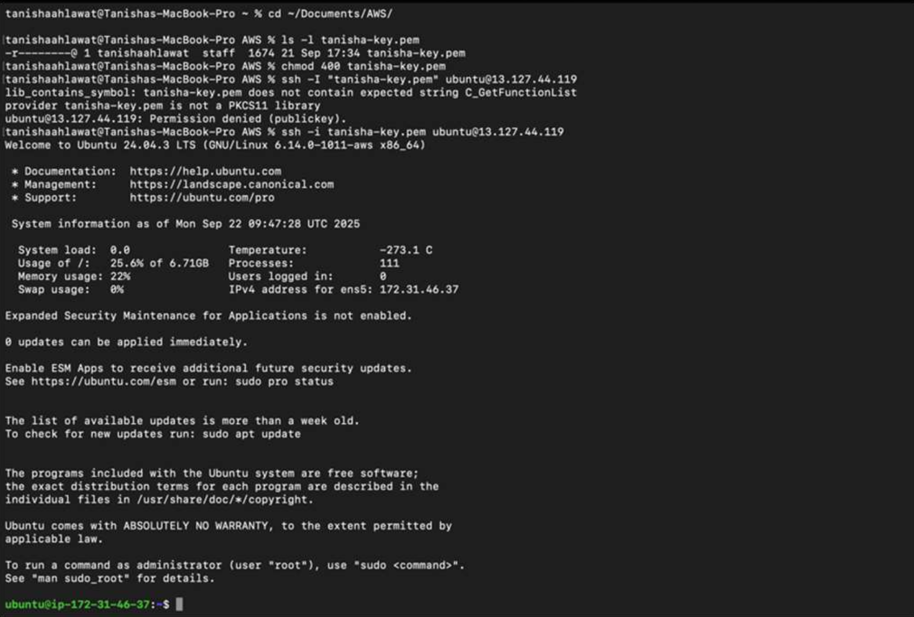
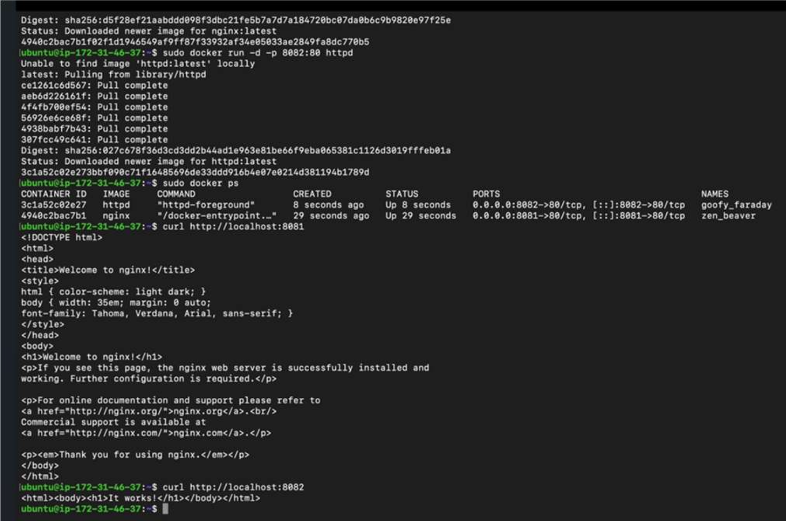
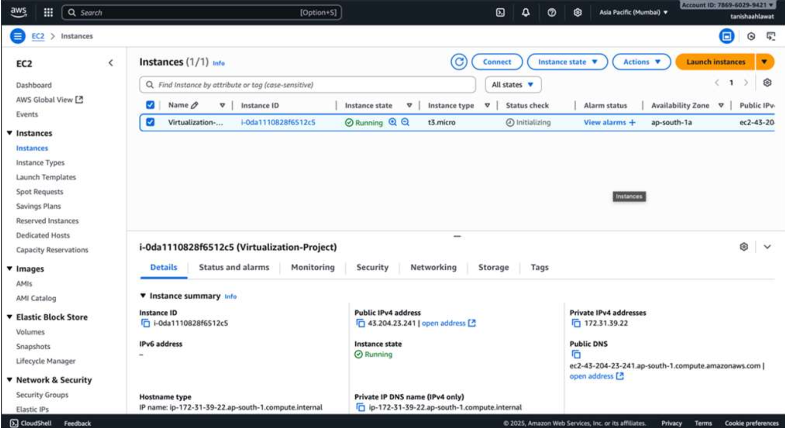
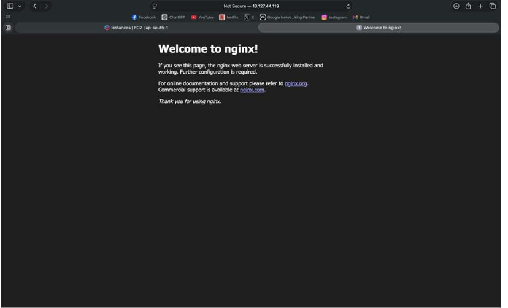
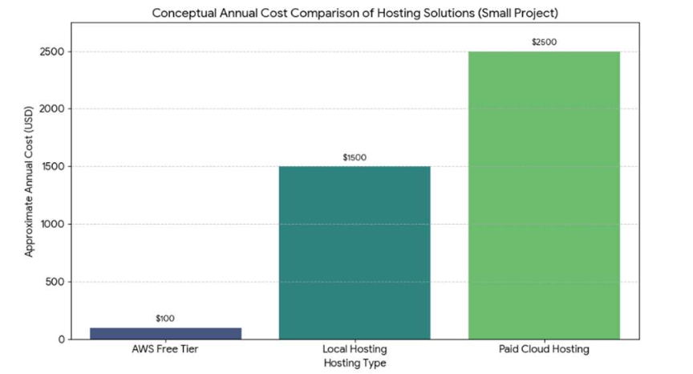

# 🖥️ Virtualization Using Cloud Computing
### AWS EC2 · Docker · Flask · React Dashboard


> A working cloud-based virtualization framework built on AWS Free Tier. Demonstrates VM-based and container-based virtualization, REST API orchestration, and a live web dashboard — all deployed within 24 hours at zero cost.
>
> 📄 Published as a conference paper: *"Virtual Desktop Infrastructure using AWS WorkSpaces"* — VIT Chennai, 2026.

---

## 📌 Table of Contents
- [Overview](#-overview)
- [Architecture](#-architecture)
- [Tech Stack](#-tech-stack)
- [Project Structure](#-project-structure)
- [Setup & Deployment](#-setup--deployment)
- [API Endpoints](#-api-endpoints)
- [Screenshots](#-screenshots)
- [Results Summary](#-results-summary)
- [Team](#-team)

---

## 🔍 Overview

This project implements a **layered virtualization architecture** on AWS, demonstrating how cloud-based virtual environments can be created, orchestrated, and monitored through a web interface.

Key achievements:
- Deployed an **AWS EC2 Ubuntu instance** as the virtualized host environment
- Ran **multiple Docker containers** (Nginx, HTTPD) as isolated virtual services inside EC2
- Built a **Flask REST API** to serve container status and metadata to the frontend
- Developed an **HTML/JS dashboard** that dynamically connects to the cloud backend via HTTP
- Achieved **zero-cost operation** using AWS Free Tier for the entire infrastructure
- Demonstrated **distributed teamwork** over cloud infrastructure (backend + frontend split)

---

## 🏗️ Architecture

```
┌─────────────────────────────────────────────────────┐
│                  AWS EC2 (Ubuntu)                   │
│                                                     │
│  ┌──────────────┐    ┌─────────────────────────┐    │
│  │  Flask API   │    │    Docker Containers     │    │
│  │  Port: 5000  │◄──►│  Nginx  (Port 8081:80)  │    │
│  │              │    │  HTTPD  (Port 8082:80)  │    │
│  └──────┬───────┘    └─────────────────────────┘    │
│         │                                           │
└─────────┼───────────────────────────────────────────┘
          │  HTTP (Public IP)
          ▼
┌─────────────────────┐
│  React/HTML Frontend│  ← Local or secondary machine
│  Dashboard UI       │
└─────────────────────┘
```

The system integrates three architectural layers:

| Layer | Technology | Role |
|---|---|---|
| **VM-based** | AWS EC2 (Ubuntu t2.micro) | Isolated cloud virtual machine |
| **Container-based** | Docker (Nginx, HTTPD) | Lightweight isolated services |
| **API / Control** | Flask (Python) | REST interface for orchestration |
| **Frontend** | HTML + JavaScript | Live dashboard & monitoring UI |
| **Optimization** | AWS Free Tier + Docker runtime | Zero-cost resource management |

---

## 🛠️ Tech Stack

- **Cloud**: AWS EC2 (Ubuntu Server, t2.micro — Free Tier)
- **Containerization**: Docker, Nginx, Apache HTTPD
- **Backend**: Python 3, Flask, Flask-CORS
- **Frontend**: HTML5, CSS3, Vanilla JavaScript (React-style dashboard)
- **Networking**: SSH (key-pair auth), HTTP REST, Public IP routing

---

## 📁 Project Structure

```
virtualization-using-cloud-computing/
│
├── app.py                  # Flask REST API (backend)
├── Dockerfile              # Docker image for Flask app
├── docker-compose.yml      # Multi-container orchestration
├── requirements.txt        # Python dependencies
├── ec2-setup.sh            # EC2 bootstrap script
│
├── frontend/
│   └── index.html          # Web dashboard (connects to Flask API)
│
├── screenshots/            # Evidence screenshots from deployment
│   ├── ssh-ec2-access.png
│   ├── docker-containers.png
│   ├── flask-ec2-console.png
│   ├── nginx-web-interface.png
│   └── cost-comparison.png
│
└── README.md
```

---

## 🚀 Setup & Deployment

### Prerequisites
- AWS account (Free Tier eligible)
- Docker installed locally (for testing)
- Python 3.8+

---

### Step 1 — Launch EC2 Instance

1. Go to **AWS Console → EC2 → Launch Instance**
2. Choose **Ubuntu Server 22.04 LTS (Free Tier)**
3. Instance type: **t2.micro**
4. Create or select a **key pair** (.pem file) for SSH access
5. Allow inbound ports: **22 (SSH), 5000 (Flask), 8081, 8082** in Security Group

---

### Step 2 — SSH into EC2

```bash
chmod 400 tanisha-key.pem
ssh -i tanisha-key.pem ubuntu@<your-ec2-public-ip>
```

---

### Step 3 — Bootstrap the EC2 instance

Run the setup script (or manually execute each step):

```bash
# Update & install dependencies
sudo apt update && sudo apt upgrade -y
sudo apt install -y python3-pip docker.io git

# Start Docker
sudo systemctl start docker
sudo systemctl enable docker
sudo usermod -aG docker $USER

# Clone the repo
git clone https://github.com/tanisha-ahl/virtualization-using-cloud-computing.git
cd virtualization-using-cloud-computing

# Install Python dependencies
pip3 install -r requirements.txt
```

---

### Step 4 — Deploy Docker Containers

```bash
# Start Nginx container on port 8081
sudo docker run -d -p 8081:80 nginx

# Start Apache HTTPD container on port 8082
sudo docker run -d -p 8082:80 httpd

# Verify containers are running
sudo docker ps
```

Test the containers:
```bash
curl http://localhost:8081    # Should return Nginx welcome page
curl http://localhost:8082    # Should return HTTPD page
```

---

### Step 5 — Start Flask API

```bash
python3 app.py
```

The API will be live at `http://<your-ec2-public-ip>:5000`

---

### Step 6 — Connect the Frontend

Open `frontend/index.html` in your browser. Enter your EC2 public IP when prompted, and the dashboard will connect to your live cloud backend.

---

### Using Docker Compose (Alternative)

To spin up the full stack with one command:

```bash
docker-compose up -d
```

---

## 📡 API Endpoints

| Method | Route | Description |
|--------|-------|-------------|
| `GET` | `/` | Health check — returns welcome message |
| `GET` | `/info` | Backend metadata (platform info) |
| `GET` | `/containers` | Lists all running Docker containers |

**Example response — `/containers`:**
```json
{
  "containers": [
    { "id": "a3c45d", "image": "nginx", "status": "Up 3 minutes" },
    { "id": "b8f21e", "image": "httpd", "status": "Up 3 minutes" }
  ]
}
```

---

## 📸 Screenshots

| Step | Description |
|------|-------------|
|  | **SSH Access** — Secure terminal session into EC2 via key-pair auth |
|  | **Docker Containers** — Nginx (8081) and HTTPD (8082) running and verified via curl |
|  | **Flask on EC2** — AWS Console showing instance running with Flask API deployed |
|  | **Nginx Web Interface** — Nginx container accessible through the public IP |
|  | **Cost Comparison** — AWS Free Tier vs Local Hosting vs Paid Cloud |

---

## 📊 Results Summary

| Layer | Technology | Key Outcome |
|-------|-----------|-------------|
| VM-based | AWS EC2 (Ubuntu) | Isolated virtual environment on cloud |
| Container-based | Docker (Nginx + HTTPD) | Modular, scalable service deployment |
| Backend API | Flask (Python) | Dynamic content served from cloud |
| Frontend | HTML / JavaScript | REST API integration with live updates |
| Multi-User | Distributed team (A + B) | Remote collaboration over cloud infra |
| Cost | AWS Free Tier | **Zero-cost** full deployment |

---

## 👥 Team

| Person | Role |
|--------|------|
| **Tanisha Ahlawat** | AWS setup, EC2 management, Docker, Flask backend |
| Sreenidhi J | Architecture design, optimization layer |
| Harshita Ranjan | Documentation, results analysis |
| Gnana Swathika (Faculty) | Advisor — Centre for Smart Grid Technology, VIT |

---

## 📄 Publication

This project was submitted as a conference paper:

> *"Virtual Desktop Infrastructure using AWS WorkSpaces"*  
> School of Electrical Engineering, Vellore Institute of Technology, Chennai — 2026  
> Keywords: Cloud Computing · AWS EC2 · Docker · Flask · IaaS · Virtualization

---

## 📝 License

MIT License — see [LICENSE](LICENSE) for details.
